# 🤝 Contributing to AI Tool-Using Agent System

Thank you for your interest in contributing to the AI Tool-Using Agent System! This document provides comprehensive guidelines for contributing to the project.

## 📋 Table of Contents

- [🚀 Getting Started](#-getting-started)
- [🌿 Branch Strategy](#-branch-strategy)
- [🐛 Reporting Issues](#-reporting-issues)
- [💡 Feature Requests](#-feature-requests)
- [🔧 Pull Request Process](#-pull-request-process)
- [📊 GitHub Projects & Assignment](#-github-projects--assignment)
- [🧪 Testing Guidelines](#-testing-guidelines)
- [📝 Code Style & Standards](#-code-style--standards)
- [📄 License Agreement](#-license-agreement)

## 🚀 Getting Started

### Prerequisites

Before contributing, ensure you have:

- **Python 3.10+** installed
- **Git** configured with your GitHub account
- **Fork** of the repository
- **Local development environment** set up

### Development Setup

1. **Fork the repository** on GitHub
2. **Clone your fork** locally:

   ```bash
   git clone https://github.com/YOUR_USERNAME/optimizely-assignment-mirza-azwad.git
   cd optimizely-assignment-mirza-azwad
   ```

3. **Set up the development environment**:

   ```bash
   make setup
   # or manually:
   python -m venv .venv
   source .venv/bin/activate  # Windows: .venv\Scripts\activate
   pip install -r requirements.txt
   ```

4. **Add upstream remote**:

   ```bash
   git remote add upstream https://github.com/ORIGINAL_OWNER/optimizely-assignment-mirza-azwad.git
   ```

5. **Verify setup**:
   ```bash
   make test  # Run all tests
   python main.py "What is 2+2?" -a stub -v  # Test basic functionality
   ```

## 🌿 Branch Strategy

The project follows a **dual-branch strategy** with specific contribution guidelines:

### Main Branches

#### 🌟 **main** Branch

- **Purpose**: Stable, production-ready code
- **Protection**: Protected branch with required reviews
- **Direct Commits**: ❌ Not allowed
- **Merge Requirements**:
  - ✅ All tests passing
  - ✅ Code review approval
  - ✅ SonarCloud quality gate passed

#### 🔧 **improvements** Branch

- **Purpose**: Enhanced features and experimental improvements
- **Protection**: Protected branch with required reviews
- **Direct Commits**: ❌ Not allowed
- **Merge Requirements**:
  - ✅ All tests passing
  - ✅ Code review approval
  - ✅ Enhanced test coverage maintained

### Feature Branch Naming

Create feature branches from the appropriate base branch:

```bash
# For stable features (targeting main)
git checkout main
git pull upstream main
git checkout -b feature/your-feature-name

# For experimental features (targeting improvements)
git checkout improvements
git pull upstream improvements
git checkout -b feature/experimental-feature-name

# For bug fixes (targeting main)
git checkout main
git pull upstream main
git checkout -b fix/issue-description

# For documentation updates
git checkout main
git pull upstream main
git checkout -b docs/documentation-update
```

### Branch Naming Conventions

| Branch Type       | Format                   | Example                           | Target Branch            |
| ----------------- | ------------------------ | --------------------------------- | ------------------------ |
| **Feature**       | `feature/description`    | `feature/add-translation-tool`    | `main` or `improvements` |
| **Bug Fix**       | `fix/issue-description`  | `fix/calculator-division-by-zero` | `main`                   |
| **Documentation** | `docs/description`       | `docs/update-api-documentation`   | `main`                   |
| **Hotfix**        | `hotfix/critical-issue`  | `hotfix/security-vulnerability`   | `main`                   |
| **Experimental**  | `experiment/description` | `experiment/llm-caching`          | `improvements`           |

## 🐛 Reporting Issues

### Before Creating an Issue

1. **Search existing issues** to avoid duplicates
2. **Check the documentation** for known solutions
3. **Test with the latest version** from the main branch
4. **Reproduce the issue** with minimal steps

### Issue Templates

#### 🐛 Bug Report

```markdown
**Bug Description**
A clear and concise description of the bug.

**Steps to Reproduce**

1. Run command: `python main.py "query"`
2. Expected behavior: ...
3. Actual behavior: ...

**Environment**

- OS: [e.g., Ubuntu 22.04, Windows 11, macOS 13]
- Python Version: [e.g., 3.10.8]
- Agent Type: [e.g., gemini, openai, stub]

**Error Logs**
```

Paste error logs here

```

**Additional Context**
Any other relevant information.
```

#### 💡 Feature Request

```markdown
**Feature Description**
A clear description of the proposed feature.

**Use Case**
Explain why this feature would be valuable.

**Proposed Implementation**
If you have ideas about implementation approach.

**Alternatives Considered**
Other solutions you've considered.

**Additional Context**
Any other relevant information.
```

### Issue Labels

| Label              | Description                   | Color     |
| ------------------ | ----------------------------- | --------- |
| `bug`              | Something isn't working       | `#d73a4a` |
| `enhancement`      | New feature or request        | `#a2eeef` |
| `documentation`    | Improvements to documentation | `#0075ca` |
| `good first issue` | Good for newcomers            | `#7057ff` |
| `help wanted`      | Extra attention is needed     | `#008672` |
| `priority: high`   | High priority issue           | `#b60205` |
| `priority: medium` | Medium priority issue         | `#fbca04` |
| `priority: low`    | Low priority issue            | `#0e8a16` |

## 💡 Feature Requests

### Feature Request Process

1. **Create an issue** using the feature request template
2. **Discuss the proposal** with maintainers and community
3. **Wait for approval** before starting implementation
4. **Create a design document** for complex features
5. **Implement in a feature branch**
6. **Submit a pull request** with comprehensive tests

### Feature Categories

#### 🛠️ **New Tools**

- Must follow the existing tool interface (`Action` base class)
- Require comprehensive error handling
- Need both unit and integration tests
- Should include API documentation

#### 🤖 **LLM Integrations**

- Must implement the `LLMStrategy` interface
- Require API key management
- Need extensive error handling for API failures
- Should include rate limiting considerations

#### 🏗️ **Architecture Changes**

- Require design document and discussion
- Must maintain backward compatibility
- Need comprehensive test coverage
- Should include migration guide if applicable

## 🔧 Pull Request Process

### Before Creating a PR

1. **Sync with upstream**:

   ```bash
   git fetch upstream
   git rebase upstream/main  # or upstream/improvements
   ```

2. **Run the full test suite**:

   ```bash
   make test
   ```

3. **Check code formatting**:

   ```bash
   make fmt
   ```

4. **Verify SonarQube compliance** (if available):
   ```bash
   make sonar_local  # or make sonar_cloud
   ```

### PR Template

```markdown
## 📝 Description

Brief description of changes made.

## 🔗 Related Issue

Fixes #(issue number)

## 🧪 Testing

- [ ] All existing tests pass
- [ ] New tests added for new functionality
- [ ] Manual testing completed

## 📋 Checklist

- [ ] Code follows project style guidelines
- [ ] Self-review completed
- [ ] Documentation updated (if applicable)
- [ ] No breaking changes (or clearly documented)

## 🖼️ Screenshots (if applicable)

Add screenshots for UI changes.

## 📊 Performance Impact

Describe any performance implications.
```

### PR Requirements

#### ✅ **Required Checks**

- **All tests passing** (180+ tests)
- **Code coverage maintained** (90%+)
- **SonarCloud quality gate** passed
- **No merge conflicts** with target branch
- **Descriptive commit messages**

#### 📝 **Code Review Process**

1. **Automated checks** must pass
2. **At least one approval** from maintainers
3. **Address review feedback** promptly
4. **Squash commits** if requested
5. **Final approval** before merge

### Commit Message Format

Follow the [Conventional Commits](https://www.conventionalcommits.org/) specification:

```
<type>[optional scope]: <description>

[optional body]

[optional footer(s)]
```

**Examples:**

```bash
feat(tools): add translation tool with Google Translate API
fix(calculator): handle division by zero gracefully
docs(readme): update installation instructions
test(weather): add edge case tests for extreme temperatures
refactor(llm): simplify strategy pattern implementation
```

**Types:**

- `feat`: New feature
- `fix`: Bug fix
- `docs`: Documentation changes
- `test`: Adding or updating tests
- `refactor`: Code refactoring
- `perf`: Performance improvements
- `chore`: Maintenance tasks

## 📊 GitHub Projects & Assignment

The project uses **GitHub Projects** for task management and coordination. Here's how the workflow operates:

### Project Boards

#### 🎯 **Main Project Board**

- **Location**: Repository → Projects → "AI Tool Agent Development"
- **Purpose**: Track all development activities
- **Views**:
  - **Board View**: Kanban-style task management
  - **Table View**: Detailed task information
  - **Roadmap View**: Timeline and milestones

#### 📋 **Board Columns**

| Column             | Description                        | Automation                    |
| ------------------ | ---------------------------------- | ----------------------------- |
| **📥 Backlog**     | New issues and feature requests    | Auto-added when issue created |
| **🔍 Triage**      | Issues under review by maintainers | Manual assignment             |
| **📋 Ready**       | Approved and ready for development | Manual move after approval    |
| **🚧 In Progress** | Currently being worked on          | Auto-moved when PR linked     |
| **👀 Review**      | Pull requests under review         | Auto-moved when PR created    |
| **✅ Done**        | Completed and merged               | Auto-moved when PR merged     |

### Assignment Process

#### 🙋 **Self-Assignment**

1. **Browse available issues** in "Ready" column
2. **Comment on the issue**: "I'd like to work on this"
3. **Wait for maintainer approval** (usually within 24 hours)
4. **Get assigned** to the issue
5. **Move to "In Progress"** when you start working

#### 👥 **Maintainer Assignment**

- **High Priority Issues**: Assigned by maintainers based on expertise
- **Good First Issues**: Reserved for new contributors
- **Complex Features**: Assigned to experienced contributors

#### ⏰ **Assignment Rules**

- **One issue per contributor** at a time (for new contributors)
- **Two weeks maximum** per assignment
- **Communicate delays** in issue comments
- **Unassign yourself** if unable to complete

### Issue Lifecycle

```mermaid
graph LR
    A[📥 Issue Created] --> B[🔍 Triage]
    B --> C{Approved?}
    C -->|Yes| D[📋 Ready]
    C -->|No| E[❌ Closed]
    D --> F[🙋 Self-Assign]
    F --> G[🚧 In Progress]
    G --> H[📝 Create PR]
    H --> I[👀 Review]
    I --> J{Approved?}
    J -->|Yes| K[✅ Done]
    J -->|No| G
```



### Project Labels & Priorities

#### 🏷️ **Priority Labels**

- `priority: critical` - Security issues, system down
- `priority: high` - Important features, major bugs
- `priority: medium` - Standard features, minor bugs
- `priority: low` - Nice-to-have features, documentation

#### 🎯 **Type Labels**

- `type: bug` - Something isn't working
- `type: feature` - New functionality
- `type: enhancement` - Improvement to existing feature
- `type: documentation` - Documentation updates
- `type: refactor` - Code restructuring

#### 🛠️ **Component Labels**

- `component: tools` - Tool-related changes
- `component: llm` - LLM strategy changes
- `component: agent` - Agent logic changes
- `component: api` - API client changes
- `component: tests` - Testing improvements

### Milestone Management

#### 🎯 **Current Milestones**

| Milestone  | Description               | Target Date |
| ---------- | ------------------------- | ----------- |
| **v1.0.0** | Production-ready release  | Q1 2024     |
| **v1.1.0** | Enhanced tool ecosystem   | Q2 2024     |
| **v1.2.0** | Advanced LLM integrations | Q3 2024     |

#### 📈 **Milestone Criteria**

- **All critical issues** resolved
- **Test coverage** maintained above 90%
- **Documentation** updated
- **Performance benchmarks** met
- **Security review** completed

### Communication Channels

#### 💬 **Issue Comments**

- **Progress updates** every few days
- **Questions and clarifications**
- **Design discussions**
- **Review feedback**

#### 📧 **Maintainer Contact**

- **Complex issues**: Tag `@maintainer-username`
- **Urgent matters**: Create high-priority issue
- **General questions**: Use issue comments

### Recognition & Credits

#### 🏆 **Contributor Recognition**

- **README credits** for significant contributions
- **Release notes** mention for features
- **GitHub contributor** statistics
- **Special recognition** for outstanding work

#### 📊 **Contribution Metrics**

- **Issues resolved**
- **PRs merged**
- **Code quality improvements**
- **Documentation contributions**
- **Community support**

## 🧪 Testing Guidelines

### Test Requirements

All contributions must include appropriate tests:

#### ✅ **Required Test Types**

- **Unit Tests**: For individual functions and classes
- **Integration Tests**: For component interactions
- **Smoke Tests**: For end-to-end workflows (if applicable)

#### 📊 **Coverage Requirements**

- **Minimum Coverage**: 90% for new code
- **Existing Coverage**: Must not decrease
- **Critical Paths**: 100% coverage required

### Writing Tests

#### 🏗️ **Test Structure**

```python
class TestNewFeature:
    """Test suite for new feature."""

    @pytest.fixture
    def setup_feature(self):
        """Set up test fixtures."""
        return FeatureClass()

    def test_basic_functionality(self, setup_feature):
        """Test basic feature functionality."""
        # Arrange
        input_data = "test input"
        expected_output = "expected result"

        # Act
        result = setup_feature.process(input_data)

        # Assert
        assert result == expected_output

    def test_error_handling(self, setup_feature):
        """Test error handling scenarios."""
        with pytest.raises(SpecificError, match="expected error message"):
            setup_feature.process(invalid_input)
```

#### 🎯 **Test Categories**

| Test Type       | Location             | Purpose               | Example                          |
| --------------- | -------------------- | --------------------- | -------------------------------- |
| **Unit**        | `tests/unit/`        | Individual components | `test_calculator.py`             |
| **Integration** | `tests/integration/` | Component interaction | `test_agent_tool_integration.py` |
| **Smoke**       | `tests/smoke/`       | End-to-end workflows  | `test_gemini_smoke.py`           |

### Running Tests

```bash
# Run all tests
make test

# Run specific test file
pytest tests/unit/test_calculator.py -v

# Run with coverage
pytest --cov=src tests/ --cov-report=html

# Run smoke tests only
pytest tests/smoke/ -v
```

## 📝 Code Style & Standards

### Python Style Guide

Follow **PEP 8** with project-specific conventions:

#### 🎨 **Formatting**

- **Line Length**: 88 characters (Black default)
- **Indentation**: 4 spaces
- **Quotes**: Double quotes for strings
- **Imports**: Organized with `isort`

#### 📝 **Naming Conventions**

```python
# Classes: PascalCase
class WeatherTool:
    pass

# Functions/Variables: snake_case
def get_weather_data():
    api_key = "your_key"

# Constants: UPPER_SNAKE_CASE
API_BASE_URL = "https://api.example.com"

# Private methods: _leading_underscore
def _internal_method(self):
    pass
```

#### 📚 **Documentation**

```python
def calculate_percentage(value: float, percentage: float) -> float:
    """Calculate percentage of a value.

    Args:
        value: The base value
        percentage: The percentage to calculate (0-100)

    Returns:
        The calculated percentage value

    Raises:
        ValueError: If percentage is negative or > 100

    Example:
        >>> calculate_percentage(100, 25)
        25.0
    """
    if percentage < 0 or percentage > 100:
        raise ValueError("Percentage must be between 0 and 100")
    return value * (percentage / 100)
```

### Type Hints

Use comprehensive type hints:

```python
from typing import Dict, List, Optional, Union
from pydantic import BaseModel

def process_data(
    items: List[Dict[str, Union[str, int]]],
    config: Optional[BaseModel] = None
) -> Dict[str, Any]:
    """Process data with optional configuration."""
    pass
```

### Error Handling

Follow project error handling patterns:

```python
from src.lib.errors.tools import ToolExecutionError

class NewTool(Action):
    def execute(self, args: dict) -> str:
        try:
            # Tool logic here
            return result
        except ExternalAPIError as e:
            raise ToolExecutionError(f"API call failed: {e}") from e
        except Exception as e:
            raise ToolExecutionError(f"Unexpected error: {e}") from e
```

### Code Quality Tools

#### 🛠️ **Required Tools**

```bash
# Format code
black .

# Sort imports
isort .

# Type checking (recommended)
mypy src/

# Linting (recommended)
flake8 src/
```

#### ⚙️ **Pre-commit Hooks** (Recommended)

```yaml
# .pre-commit-config.yaml
repos:
  - repo: https://github.com/psf/black
    rev: 22.3.0
    hooks:
      - id: black
  - repo: https://github.com/pycqa/isort
    rev: 5.10.1
    hooks:
      - id: isort
```

## 📄 License Agreement

### Contribution License

By contributing to this project, you agree that:

1. **Your contributions** will be licensed under the **MIT License**
2. **You have the right** to submit the contributions
3. **You grant** the project maintainers a perpetual, worldwide, non-exclusive license to use your contributions
4. **Your contributions** are your original work or you have permission to submit them

### MIT License Summary

- ✅ **Commercial Use**: Contributions can be used commercially
- ✅ **Modification**: Contributions can be modified
- ✅ **Distribution**: Contributions can be distributed
- ✅ **Private Use**: Contributions can be used privately
- ❌ **Liability**: No warranty or liability for contributions

### Contributor Recognition

All contributors are recognized in:

- **GitHub contributor** statistics

---

## 🎉 Thank You!

Thank you for contributing to the AI Tool-Using Agent System! Your contributions help make this project better for everyone.

### Questions?

- 📖 **Documentation**: Check the [README.md](README.md)
- 🐛 **Issues**: Create a new issue for questions
- 💬 **Discussions**: Use GitHub Discussions for general questions

**Happy Contributing!** 🚀
